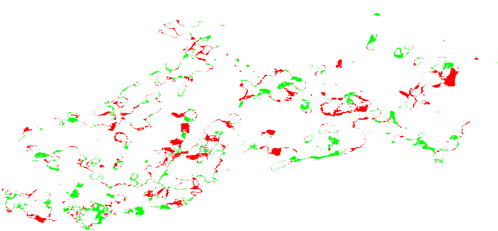

# Analysis and find diff GIS  from tiff files

The goal is to take as inputs the two tiff files and output
a csv file with the evolution of the number "4" regarding the latitude and longitude coordinates

The tiff file is an object where each pixel has a value between 0 and 8, and some coordinates associated (lat/lon)

The two file represent the same geographical area.

The goal is to retrive the coordinates (lat/lon) that have change during the two years with the label "4"

retrieve these coordinates and give them the value -1 if the label 4 has disappeared and +1 if the label 4 has appeared
in 2021 compared to 2016

# output
